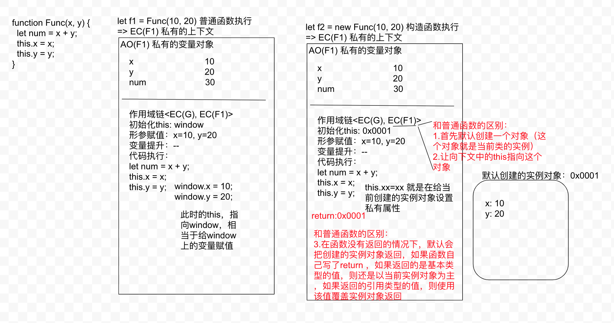

## 面向对象编程 (OOP)

- 对象，类，实例
- JS本身就是基于面向对象研发出来的编程语言，内置类：
  - 数据类型，每一个数据类型，都有一个对应的类别
  - DOM元素对象
    - div -> HTMLDivElement -> HTMLElement -> Element -> Node -> EventTarget -> Object
    - a -> HTMLAnchorElement -> HTMLElement...
    - document HTMLDocument -> Document -> Node ...
    - window -> Window
    - 元素集合 -> HTMLCollection -> Object
  - ...

## new 执行的原理

```js
// 自定义类
// 类名的第一个首字母都要大写
function Func() {}
// var f = Func() // 把它当做普通函数执行（形成私有上下文，作用域链，this, arguments, 形参赋值，变量提升，代码执行...）, f 是函数执行后的返回结果
let f = new Func(); // 构造函数执行，当做类来执行，而不是当做普通函数了，此时 Func 被称为类，返回的结果 f 是类的一个实例，是一个实例对象
console.log(f); // Func {}
```


## 构造函数执行，和普通函数执行的区别

```js
function Func(x, y) {
  let num = x + y;
  this.x = x; // 给当前实例对象设置值
  this.y = y;
}
let f1 = Func(10, 20);
let f2 = new Func(10, 20); // {x: 10, y: 20}

/* 
  构造函数执行：
    1. 和普通函数执行，基本上是一样的（具备普通函数执行的一面）
    2. 和普通函数的区别：首先默认创建一个对象，这个对象就是当前类的实例。让上下文中的 this 指向这个对象
    3. 区别：在函数没有返回值的情况下，默认会把创建的实例对象返回，如果函数中自己写了return ，如果返回的基本类型的值，还是会返回创建的实例，如果返回的是引用类型的值，自己写的返回值会覆盖创建的实例
 */
function Func(x, y) {
  let num = x + y; // num 只是一个私有变量，和实例没有关系，只有 this 是实例对象
  this.x = x;
  this.y = y;
  return num; // 返回基本类型的值，f2依然是当前实例对象
  return { name: 'xxx' }; // 如果返回的是一个引用类型的值，一切都以自己返回的为主，此时的 f2 = {name: 'xxx'} ,不再是当前实例了
}
let f2 = new Func(10, 20); // {x: 10, y: 20}

```

## 基于instancesof 可以检测当前对象是否为某个类的实例

```js
function Func(x, y) {
  let num = x + y;
  this.x = x;
  this.y = y;
  // return { name: 'xxx' };
}
let f2 = new Func(10, 20); // {x: 10, y: 20}
console.log(f2 instanceof Func); // 如果 Func 没有返回值，Func 的实例就是 f2, 如果有返回，则不再是它的实例
```

每一个对象（包含实例对象）都有很多属性和方法，在自己内存中存储的是私有的属性方法，基于 `__proto__` 原型链查找类原型上的都是共有属性方法

检测属性是当前对象私有的还是公有的？
  1. 对象.hasOwnProperty(属性)， 检测是否为私有属性，只有私有属性才会返回ture，如果有公有的属性，也会返回 false
  2. 属性 in 对象，检测是否为他的属性（不论公有还是私有的都是可以）

```js
function Func(x, y) {
  let num = x + y;
  this.x = x;
  this.y = y;
}
let f2 = new Func(10, 20);

console.log('x' in f2); // true
console.log(f2.hasOwnproperty('x')); // true

console.log('toString' in f2); // true
console.log(f2.hasOwnproperty('toString')); // false 此方法是原型上的公有方法
```

