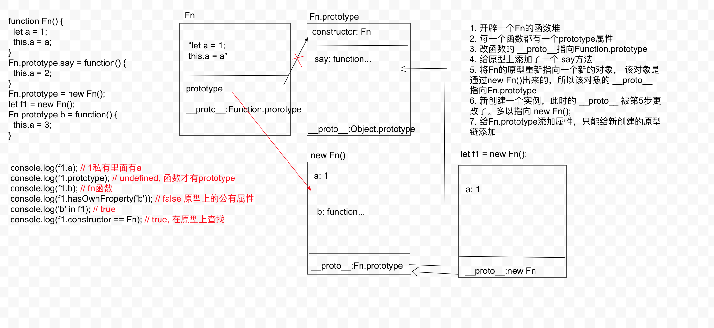
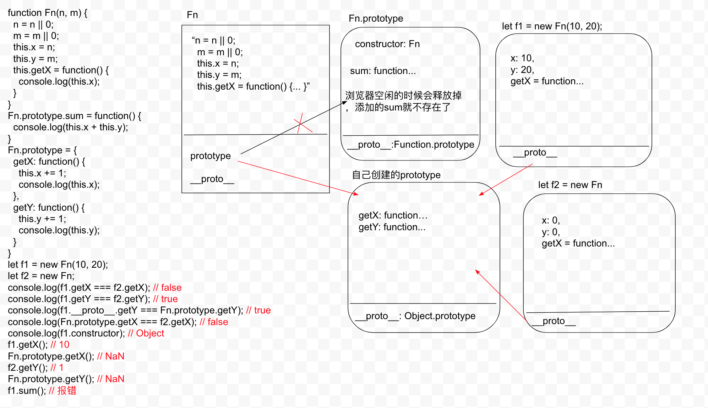

## 作业1

```js
function C1(name) {
  if (name) {
    this.name = name;
  }
}
function C2(name) {
  this.name = name;
}
function C3(name) {
  this.name = name || 'join';
}
C1.prototype.name = 'Tom';
C2.prototype.name = 'Tom';
C3.prototype.name = 'Tom';
alert((new C1().name) + (new C2().name) + (new C3().name));
// Tom + undefined + join
```
## 作业2

```js
function Fn() {
  let a = 1;
  this.a = a;
}
Fn.prototype.say = function() {
  this.a = 2;
}
/* 
  原来的Fn.prototype:
    say: function...
    __proto__: Function.prototype
 */
Fn.prototype = new Fn();
/* 
  新的Fn.prototype:
    a: 1,
    b: function...
  __proto__: 原来的Fn.prototype
 */
let f1 = new Fn();
/* 
  f1:
    a: 1
  __proto__: 新的Fn.prototype
 */
Fn.prototype.b = function() {
  this.a = 3;
}
console.log(f1.a); // 1
console.log(f1.prototype); // undefined,只有函数才有prototype属性
console.log(f1.b); // fn函数
console.log(f1.hasOwnProperty('b')); // false
console.log('b' in f1); // true
console.log(f1.constructor == Fn); // true
```



## 作业3

```js
function Fn(n, m) {
  n = n || 0;
  m = m || 0;
  this.x = n;
  this.y = m;
  this.getX = function() {
    console.log(this.x);
  }
}
/* 
  Fn.prototype:
    sum: function...
    __proto__: Function.prototype
 */
Fn.prototype.sum = function() {
  console.log(this.x + this.y);
}
/* 
  // 被覆盖了，原来的prototype在空闲时被释放
  Fn.prototype:
    getX: function...
    getY: function...
    __proto__: Object.prototype
 */
Fn.prototype = {
  getX: function() {
    this.x += 1;
    console.log(this.x);
  },
  getY: function() {
    this.y += 1;
    console.log(this.y);
  }
}
let f1 = new Fn(10, 20);
/* 
  f1:
    x: 10,
    y: 20,
    getX: function...
  __proto__: Fn.prototype
 */
let f2 = new Fn;
/* 
  f2:
    x: 0,
    y: 0,
    getX: function...
  __proto__: Fn.prototype
 */
console.log(f1.getX === f2.getX); // false
console.log(f1.getY === f2.getY); // true
console.log(f1.__proto__.getY === Fn.prototype.getY); // true
console.log(Fn.prototype.getX === f2.getX); // false
console.log(f1.constructor); // Object
f1.getX(); // 10
Fn.prototype.getX(); // NaN
f2.getY(); // 1
Fn.prototype.getY(); // NaN
f1.sum(); // 报错
```

