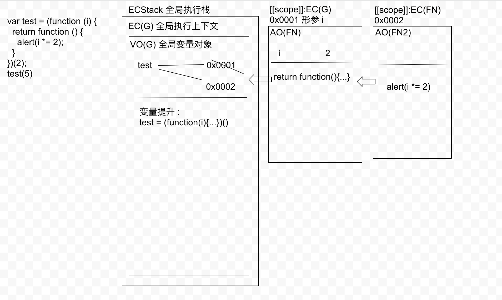
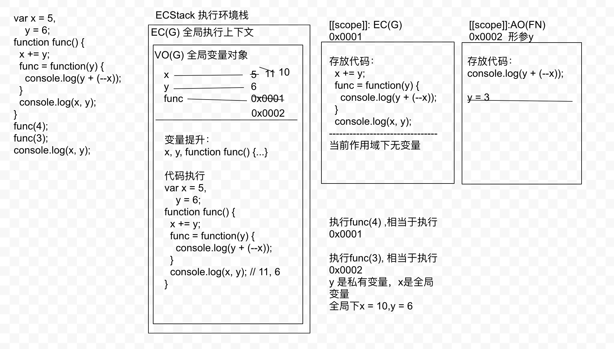

```js
let arr = [10.18, 0, 10, 25, 23];
arr = arr.map(parseInt);
console.log(arr); // [10, NaN, 2, 2, 11]
/*
  parseInt 首先把第一项转为字符串，让后看做某进制（2-36），转为10 进制
  parseInt(10.18, 0); // 10
  parseInt(0, 1); // NaN
  parseInt(10, 2); // 2
  parseInt(25, 3); // 2
  parseInt(23, 4); // 11
 */
```

```js
var a = 10,
    b = 11,
    c = 12;
function test(a) {
  a = 1; // 私有的 a = 1;
  var b = 2; // 局部变量
  c = 3;
}
test(10);
console.log(a, b, c); // 10, 11, 3

/* 
  EC(G) 变量提升:
    var a, b, c => 同时给window中也设置相关的属性
    function test(a){ ... }
  EC(test) 私有上下文
    初始化作用域链 <EC(test), EC(G)>
    初始化this, arguments
    形参赋值：a = 10; [此时a是私有变量]
    变量提升
      var b [b是私有变量]
 */

/* 
  只有在出函数以外的{}中的函数，在不同的浏览器中表现不一致
  低版本中是声明加定义，高版本中是只声明（高版本还会把{} 当做块级作用域）
 */
```

```js
var a = 4;
function b(x, y, a) {
  /* 
    EC(b) 私有上下文
      初始化作用域链<EC(b), EC(G)>
      初始化this
      初始化arguments,函数内置实参集合（类数组）{0: 1, 1: 2, 2: 3, length: 3};
      形参赋值： x = 1, y = 2, a = 3
    => 在JS非严格模式下，函数中初始化arguments 和 形参赋完值完成后，浏览器会按照顺序把形参和arguments中的每一项都建立映射机制（一改都改）
      x -> arguments[0]
      y -> arguments[1]
      a -> arguments[2]
   */
  console.log(a); // 3
  arguments[2] = 10;
  console.log(a); // 10
  x = 100;
  console.log(arguments[2]); // 100
}
a = b(1, 2, 3); // 把函数执行，把执行后的返回值赋值给a，没有return 默认是undefined
console.log(a); // undefined // 函数没有返回值

/* 
  EC(G) 变量提升
    var a
    function b(x, y, a){ ... } [[scope]]:EC(G)
 */

"use strict"; // => 开启严格模式
var a = 4;
function b(x, y, a) {
  /* 
    在严格模式下 x/y/a 和 arguments 没有映射机制，是独立的
   */
  console.log(a); // 3
  arguments[2] = 10; // a的值不会变
  console.log(a); // 3
  a = 100;
  console.log(arguments[2]); // 10
}
a = b(1, 2, 3);
console.log(a); // undefined

/* --------------------------------- */
function func(x, y, z) {
  /* 
    初始化arguments(实参集合，和形参没有关系): {0: 10, 1: 20, length: 2}
    形参赋值：x = 10, y = 20, z = undefined
    ==> 映射关系
      x -> arguments[0]
      y -> arguments[1]
      z -> arguments中没有索引为2的值，不能建立映射
   */
  x = 100;
  console.log(arguments[0]); // 100

  arguments[1] = 200;
  console.log(y); // 200

  z = 300;
  console.log(arguments[2]); // undefined
}
func(10, 20);
```

```js
{
  function foo() {}
  foo = 1;
  /* 
    高版本浏览器中 {} 里面的function只是提前声明，不赋值
    如果 {} 中有函数/let/const 会形成一个块级作用域

    虽然foo是私有的，但是为了兼容ES3,在全局中之前这个foo声明过，浏览器会把运行之前对 foo 的操作映射到全局上一份
    下面的代码就是操作私有的变量了
  */
}
console.log(foo); // fn

{
  function foo() {}
  foo = 1;
  function foo() {} // 代码执行到此处，会将之前的代码映射到全局一份，所以全局的foo 变成了1
  // 在严格模式下 会报 foo 重复定义
  // Uncaught SyntaxError: Identifier 'foo' has already been declared
}
console.log(foo); // 1

{
  function foo() {}
  foo = 1;
  function foo() {} // 只将这里之前的代码映射到全局一份了
  foo = 2;
}
console.log(foo); // 1
```

```js
var a = 9;
function fn() {
  a = 0;
  return function (b) {
    return b + a++;
  }
}
var f = fn();  // a = 0
console.log(f(5)); // b = 5, res = 5, a = 1
console.log(fn()(5)); // b = 5, res = 5
console.log(f(5)); // b = 5, res = 6, a = 2
console.log(a); // a = 2
```

```js
var test = (function (i) {
  return function () {
    alert(i *= 2);
  }
})(2);
test(5)

/* 
  test = function () {
    alert(i *= 2) // '4'
  }
 */
```


```js
var x = 5,
    y = 6;
function func() {
  x += y;
  func = function(y) {
    console.log(y + (--x));
  }
  console.log(x, y);
}
func(4); // 11, 6
// x = 11, y = 6
// func = function(y) {}
func(3); // 13
// 私有的 y = 3, x = 11
// 3 + 10 = 13, x = 10
console.log(x, y); // x = 10, y = 6
```


```js
function fun (n, o) {
  console.log(o);
  return {
    fun: function(m) {
      return fun(m, n);
    }
  }
}
var c = fun(0).fun(1); // undefined 0
/* 
  fun(0); n = 0; o = undefined;
  c = {
    fun: function(m) {
      return fun(m, n)
    }
  }
  c.fun(1); n = 1, o = 0;
  c = {
    fun: function(m) {
      return fun(m, n)
    }
  }
 */
c.fun(2); // 1
/* 
  m = 2, n = 1;
  执行后 n = 2, o = 1;
 */
c.fun(3); // 1
/* 
  m = 3, n = 1
  执行后：n = 3, o = 1
 */
```

```js
(function() {
  console.log('ok');
  arguments.callee(); // 使用此方法可以递归调用当前自执行函数，但是在严格模式下不支持
})()

```