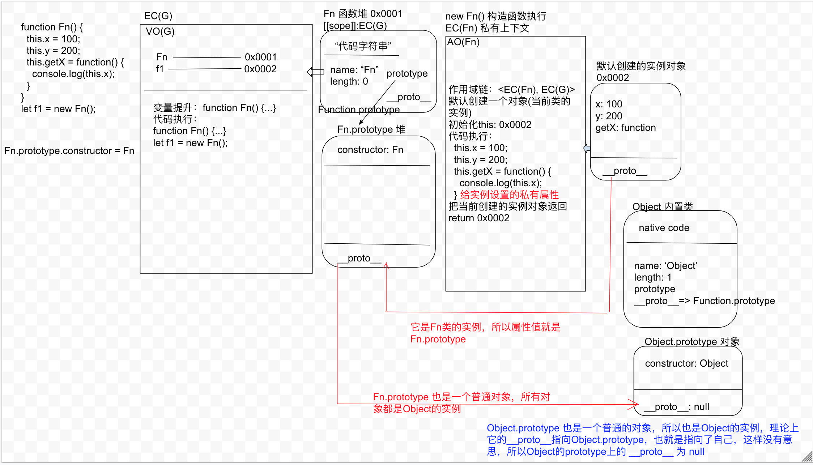
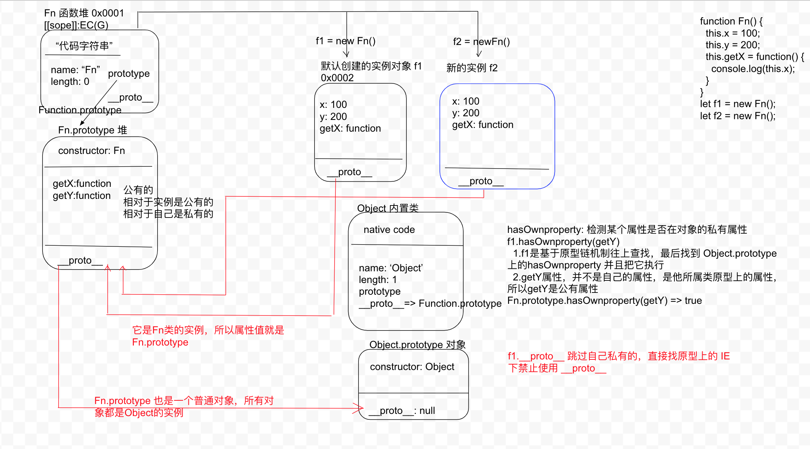

## 原型prototype和原型链__proto__

- 每一个类（函数）都具备prototype,并且属性值是一个对象
- 对象上天生具备一个 constructor 指向类本身
- 每一个对象（普通对象，prototype，实例，函数等）都具备 __proto__ 属性值是当前实例所属类的原型

```js
function Fn() {
  this.x = 100;
  this.y = 200;
  this.getX = function() {
    console.log(this.x);
  }
}
let f1 = new Fn();
/* 
  函数数据类型：普通函数，类（内置类\函数类）,箭头函数（都是 Founction的实例）
  普通数据类型：普通对象，数组对象，正则对象，日期对象，实例对象，函数对象（函数也是一个对象，也像普通对象一样，也有自己的键值对），类的prototype 也是对象（都是Object的实例）

  1. 每一个函数（除ES6中的箭头函数外）都有一个内置的属性:prototype（原型属性），属性值是一个对象，在对象中会存储当前类的公共属性和方法
  2. 在prototype 的堆内存中，如果是浏览器为其开辟的堆内存，会存在一个内置的属性 constructor(构造函数)，属性值就是类本身
    Fn.prototype.constructor => Fn
  3. 每一个对象都有一个内置属性，__proto__ （原型链属性），属性值是 当前实例所对应的类的 prototype 这个堆
 */

/* 
原型链机制：调用实例对象的某个属性，先看自己私有里面是否存在，不存在则默认按照 __proto__ 找所属类上的公有属性和方法，如果还没有，再基于 prototype上的 __proto__ 向上查找，直到找到Object.prototype 为止
*/

/* 
  hasOwnproperty: 检测某个属性是否在对象的私有属性
  f1.hasOwnproperty(getY)
    1.f1是基于原型链机制往上查找，最后找到 Object.prototype 上的hasOwnproperty 并且把它执行
    2.getY属性，并不是自己的属性，是他所属类原型上的属性，所以getY是公有属性

  Fn.prototype.hasOwnproperty(getY) => true 使用的也是Object.prototype

 */

```


```js
function Fn() {
  this.x = 100;
  this.y = 200;
  this.getX = function() {
    console.log(this.x);
  }
}
Fn.prototype.getX = function() {
  console.log(this.x);
}
Fn.prototype.getY = function() {
  console.log(this.y);
}

let f1 = new Fn();
let f2 = new Fn();
/* 
  先找自己私有里面的属性和方法。如果没有再找原型链上公有的属性
 */
console.log(f1.getX === f2.getX); // false
console.log(f1.getY === f2.getY); // true
console.log(f1.__proto__.getY === Fn.prototype.getY); // true // f1.__proto__ 跳过自己私有的，直接找原型上的 IE 下禁止使用 __proto__
console.log(f1.__proto__.getX === f2.getX); // false
console.log(f1.getX === Fn.prototype.getX); // false
console.log(f1.constructor); // Fn
console.log(Fn.prototype.__proto__.constructor); // Object
f1.getX(); // 100
f1.__proto__.getX(); // undefined
f2.getY(); // 200
Fn.prototype.getY(); // 200

/* 
  f1.getX()
    1. 先要确定执行的是哪一个方法
    2. 执行方法（方法中的this，看函数执行的前面是否有. 如果有，. 前面是谁，this就执行谁，没有就是 window/undefined）
    3. 确定好this后直接执行代码
  this => f1 => f1.x

  f1.__proto__.getX()
    this => f1.__proto__
    this.x => f1.__proto__.this => undefined

  f2.getY();
    getY 是原型上的方法
    this => f2
    this.y => f2.y => 200

  Fn.prototype.getY()
    this => Fn.prototype
    this.y => Fn.prototype.y => undefined
 */
```


