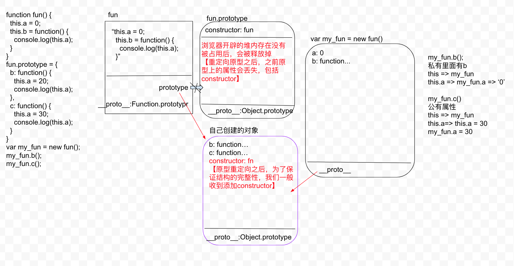

```js
function fun() {
  this.a = 0;
  this.b = function() {
    console.log(this.a);
  }
}
fun.prototype = {
  b: function() {
    this.a = 20;
    console.log(this.a);
  },
  c: function() {
    this.a = 30;
    console.log(this.a);
  }
}
/* 
  EC(G):
    a = 0;
    b = function() {...}

  func.prototype
    b = function() {}
    c = function() {}
 */
var my_fun = new fun();
my_fun.b(); // 0
my_fun.c(); // 30
```



## 基于内置类的原型扩展方法

1. 内置类的原型上会存在很多常用的方法 `Array.prototype/Object.prototype` 这些方法实例都可以调用，但是内置的方法不能满足需求，需要自己扩展一些方法
2. 向原型上扩展方法调用起来比较方便，方法中的this就是当前处理的实例
   - 自己写的方法最好加个前缀，比如 My_xxx，防止自己扩展的方法覆盖内置的方法
   - this 的结果一定是对象类型的值，所以在基本数据类型的原型上扩展方法的时候，方法在执行的时候，方法中的this，不再是基本类型, 还是按照原始的类型处理即可(在运算的时候会默认调用对象的valueOf 方法，返回他的原始值，就是之前的基本值)
   - 如果返回的结果依然是当前类的实例，还可以继续调用当前类原型上的其他方法（如果不是自己类的实例，可以调用其他原型上的方法 =》 链式写法）
3. 对于一个对象来说，它的属性方法（私有/公有）存在枚举的特点，在for in 循环的时候是否可以遍历到，能遍历到的就是可枚举的，不能遍历则不可枚举。内置类型上自己扩展的方法是可枚举的


```js
let n = 10;
(function() { // 私有方法，handleNum 只能在内部使用
  function handleNum(num) { // 更加严谨的写法
    num = Number(num);
    return isNaN(num) ? 0 : num;
  }
  Number.prototype.plus = function plus(num) { // 如果传入的不是 number 类型的值，就调不了此方法
    console.log(this); // Number {10}
    return this + handleNum(num);
  }
  Number.prototype.minus = function minus(num) {
    return this - handleNum(num);
  }
})()

let m = n.plus(10).minus(5);
console.log(m) // 10 + 10 - 5 = 15;
```

```js
// obj.__proto__ = Object.prototype
/* 
  内置原型上的方法是不可枚举的
 */
let obj = {
  name: 's',
  age: 10
};
Object.prototype.aa = function() {
  console.log(this)
}
// 原型上的自己扩展的属性和方法，是可以被枚举的，所以一般会加一个 hasOwnProperty 来过滤原型上的方法
for (let key in obj) {
  // 将原型上扩展的公共属性或者方法过滤掉
  if (!obj.hasOwnPorperty(key)) {
    break;
  }
  console.log(key); // name age
}
```

