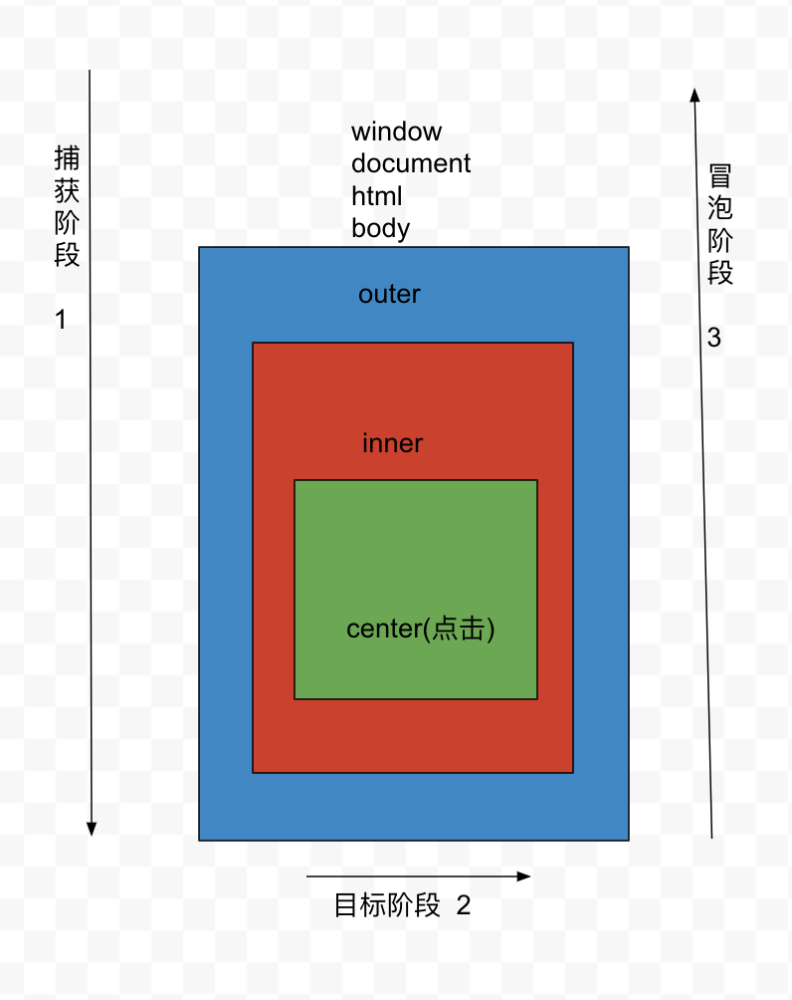

## 事件的传播机制

- Event.prototype:
  + AT_TARGET: 2 => 目标阶段
  + BUBBLING_PHASE: 3 => 冒泡阶段
  + CAPTURING_PHASE: 1  => 捕获阶段

- 当前元素的某个事件被触发，一定会经历三个阶段：
  + 捕获阶段：从最外层容器一直向里层查找，知道找到当前触发的事件源为止，查找的目的，建立起当前元素未来冒泡传播的路线
  + 目标阶段：把当前元素的相关事件行为触发，如果绑定了方法则把方法执行
  + 冒泡阶段：不仅当前元素的相关事件行为会被触发，而且，在捕获阶段获取的路径中的每一个元素的相关事件行为也会触发（顺序从里向外）（其父级所有的相关事件行为也会被触发），如果也对应绑定了方法，方法也会被触发执行



```html
<!-- 事件传播 -->
<div id="outer">
  <div id="inner">
    <div id="center"></div>
  </div>
</div>

<script>
  document.body.onclick = function(e) {
    console.log('body:', e)
  }
  outer.onclick = function(e) {
    console.log('outer:', e)
  }
  inner.onclick = function(e) {
    console.log('inner:', e)
  }
  center.onclick = function(e) {
    e.stopPropagation(); // 阻止冒泡
    console.log('center:', e)
  }
</script>
```