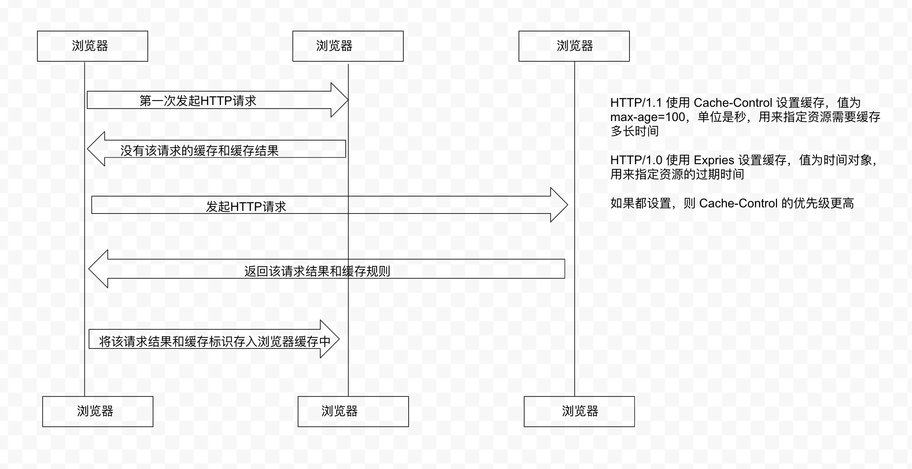

## 页面优化

- 减少DNS请求次数
- DNS预获取
  + 浏览器遇到 `<link rel="dns-prefetch" href="//static.360buyimg.com">` 会派另一个线程去解析DNS，浏览器会继续渲染页面
  + 允许的最大并发数是 6-7 个
- 减少HTTP请求次数和资源大小
  - 资源合并压缩
  - 字体图标
  - Base64
  - Gzip（一般文件能压缩60%以上）
  - 图片懒加载
  - 数据延迟分批加载
  - CDN资源
- 应用缓存

## 缓存

1. 资源缓存
  - 强缓存
    - 每一次向服务器发送请求获取资源文件，都会先看一下本地是否有缓存（先看是否有强缓存，没有再去看是否有协商缓存，都没有才是重新获取资源）
  - 协商缓存
2. 数据缓存
  - GET请求缓存（一般不要，因为是不可控的）
  - 第一次获取数据，如果这些数据不是需要经常更新的，我们会基于本地存储把数据缓存起来，在一定时间内，再加载页面，直接从本地缓存获取数据

缓存的位置：

  - Service Worker 浏览器独立线程缓存（一般很少用）
  - Memory Cache 内存缓存
  - Disk Cache 硬盘缓存
  - Push Cache 推送缓存（http2中的）

打开网页，地址栏输入地址，差汇总啊disk cache 中是否有匹配，如果有则使用，如果没有则发送请求

## 强缓存 Expries/Cache-Control

常用的是 Cache-Control(HTTP/1.1): max-age=0

Cache-Control： `Cache-Control:max-age=2592000` 第一次拿到资源后的 2592000（30天） 秒内，再次发送请求，读取缓存中的信息(HTTP/1.1)

Expries (HTTP/1.0) 如果两个都设置，以 Cache-Control 为主，如果不支持再走Expries

浏览器向服务端发请求后，服务端会设定 Cache-Control 和Expries ，浏览器看到这两个字段后就会把资源强制缓存起来

## 协商缓存 Last-Modified（HTTP/1.0）/ETag（HTTP/1.1）

协商缓存就是强制缓存失效后，浏览器携带缓存标识想服务器发送请求，由服务器根据缓存标识觉得是否使用缓存的过程

协商缓存是存在HTTP请求的，如果协商缓存生效，返回 304 和 Not Modified

### Last-Modified和If-Modified-Since

第一次访问资源，服务器返回资源的同时，响应头中设置Last-Modified（服务器上的最后修改时间）浏览器收到后，缓存文件和响应头，下一次请求这个资源时，浏览器检测有 Last-Modified ，于是就会添加 If-Modified-Since 请求头，值是 Last-Modified 中的值，服务器再次收到这个请求，会根据 If-Modified-Since 中的值与服务器最后修改的时间对比，如果没有变化，返回 304 和空的响应体，浏览器直接从缓存取。如果 If-Modified-Since 小于服务器中这个资源的最后修改时间，于是返回资源文件和 200。但是Last-Modified 只能以秒计，如果在不可感知的时间内修改了文件，那么服务器还是会认为命中了缓存，并不会返回资源。

### Etag和If-None-Match

第一次请求资源，服务器会返回资源文件的一个唯一标识（由服务器生成）只要资源变化，Etag就会重新生成，下一次加载资源向服务器发送请求时，会将上一次返回的的Etag放在 If-None-Match 中，服务端只需要比较客户端传来的 If-None-Match 跟自己服务器上生成的Etag是否一致，就能很好的判断出，当前的资源相对于客户端是否发生变化过，如果Etag是一直的，那直接返回304和空的响应体，如果不一样，则返回200，将Etag设置为最新的标识。

