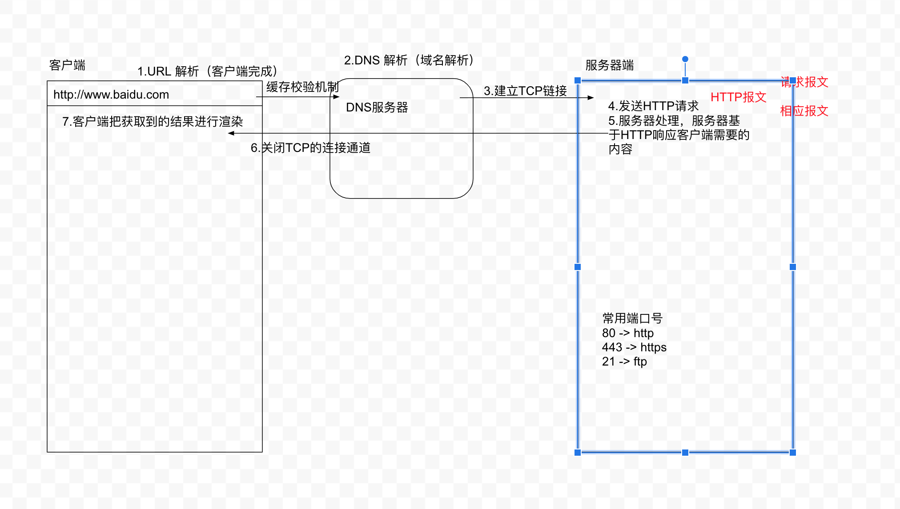
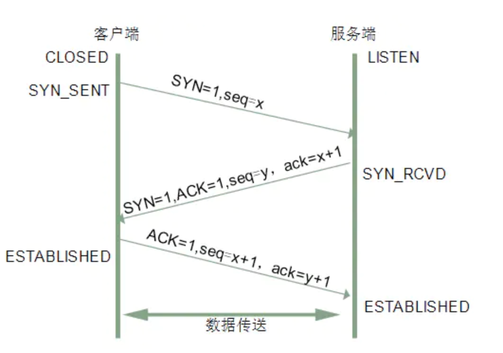
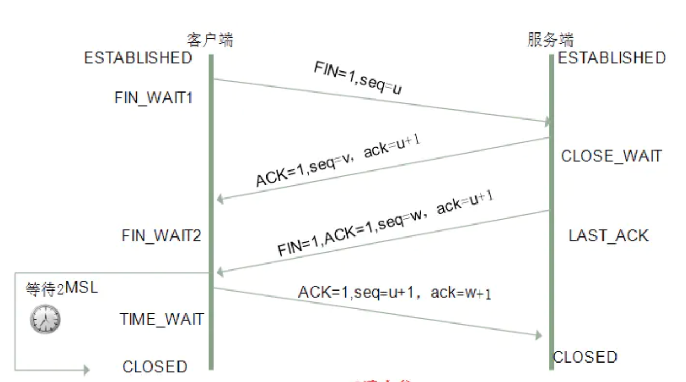

## 当用户在浏览器地址栏输入一个网址，到看到整个页面，中间都经历了哪些事情

1. URL解析（客户端完成）
2. DNS域名解析（DNS服务器）
3. 建立TCP连接（3次握手）
4. 发送HTTP请求
5. 服务器处理，服务器基于HTTP响应客户端需要的内容
6. 关闭TCP的连接通道（4次挥手）
7. 客户端渲染

## URL 组成部分

> 区分 URI/URL/URN

1. URI = Universal Resource Identifier 统一资源标志符
2. URL = Universal Resource Locator 统一资源定位符
3. URN = Universal Resource Name 统一资源名称

[URI/URL/URN参考链接](https://www.jianshu.com/p/09ac6fc0f8cb)

协议://   域名       :端口号/请求的路径名称?问号传参            #哈希值
http://www.baidu.com:80/home/index.html?type=1&query=hello#video

传输协议：就是用来在服务器和客户端之间进行信息传入的

  - http 超文本传输协议
  - https 比http更安全（里面涉及了SSL加密）
  - ftp 文件上传下载协议（把文件上传到服务器）

> 推荐图解HTTP：HTTP1.1/1.0/2.0   https VS http

域名：顶级域名，一级域名，二级域名 ...

  - www.qq.com 顶级域名（有的也叫一级域名）
  - sport.qq.com 二级域名
  - kbs.sport.qq.com 三级域名 

? 传参：应用场景比较多

  - 客户端想把信息传递给服务器（GET系列请求）
  - 从客户端A页面跳转到B页面，两个页面就可以通过 ? 传参
  - 编码/解码
    - encodeURI/decodeURI -- 对整个URL处理，把里面的汉字和特殊字符进行编码、解码
    - encodeURIComponent/decodeURIComponent -- 对所有的符号进行编码、解码，一般只针对参数处理
    - escape/unescape -- 这个一般只在客户端使用

哈希 #

  - hash 路由
  - 锚点定位

## DNS解析

- 本地的DNS解析（缓存）
  - 客户端 -> 浏览器缓存 -> 本地的hosts文件 -> 本地DNS解析器缓存 -> 本地DNS服务器
- 网络DNS解析

## TCP 三次握手（客户端和服务端建立链接）

## TCP 四次挥手（TCP关闭链接）

