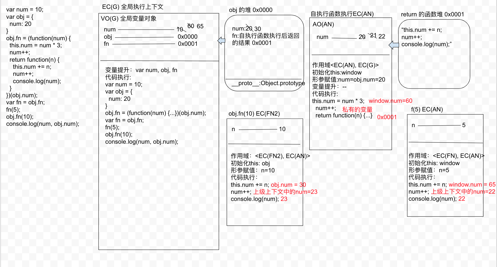

## this 的五种情况

全局上下文下，this是window，块级上下文中没有自己的this,继承上级上下文中的this，在函数的私有上下文中，this的情况也会多种多样，接下来我们重点研究

this 不是执行上下文（EC才是执行上下文），this是执行主体

如何区分执行主体：

  1. 事件绑定：给事件的某个事件行为绑定方法，当事件触发，方法执行，方法中的this是当前元素本身（特殊：IE~IE8中基于 attachEvent方法实现的DOM2事件绑定，事件触发后，方法中的this指向window，而不是元素本身）

```js
  // 事件绑定
  // DOM0
  let body = document.body;
  body.onclick = function() {
    console.log(this); // 方法中的this指向 body
  }
  // DOM2
  body.addEventListener('click', function() {
    console.log(this); // 指向body
  });
  // IE6~IE8
  body.attachEvent('onclick', function() {
    console.log(this); // 指向window
  })
```

  2. 普通方法执行（包含自执行函数执行，普通函数执行，对象成员反问读取方法执行），只需要看函数执行的时候，方法名前面是否有 "点(.)" , "点(.)" 前面是谁this就是谁，如果没有，this就是window（严格模式下是undefined）

```js
// 自执行函数
// "use strict"; // 如果开启严格模式，this => undefined
(function() {
  console.log(this); // window
})();

let obj = {
  fn: (function() {
    console.log(this); // window
    return function() {}
  })() // 把自执行函数执行的结果赋值给Obj.fn
}
// 普通执行
function func() {
  console.log(this);
}
let obj = {
  func: func
}
func(); // 方法中的this => window
obj.func(); // 方法中的this => obj

[].slice(); // =》 数组中的实例基于原型链机制，找到Array 原型上的slice方法,然后再把slice执行，此时 slice 中的this一定是当前数组
Array.prototype.slice(); // slice执行中的this：Array.prototype

function func() {
  console.log(this); // window
}
document.body.onclick = function() {
  console.log(this); // body
  func(); // 此处是在window上调用的
}
// 点击body 之后，输出的结果是window
// 点击body 先之后回调函数，里面的this是body，再给window上执行的func
```

  3. 构造函数执行（new xx）：构造函数中的this是当前类的实例

```js
function Func() {
  this.name = 'shenjp';
  console.log(this); // 构造体函数中的this,在构造体函数执行的情况下，是当前类的一个实例，并且this.xx=xx，是给当前实例设置属性
}
Func.prototype.getName = function() {
  console.log(this); // 只有在执行的时候才能确定,不一定都是实例，看之后的时候 “点(.)” 前面的内容
}
let f = new Func();
f.getName();
f.__proto__.getName();
Func.prototype.getName();
```

  4. ES6 中提供了 Arrow function(箭头函数)，箭头函数没有自己的this（也没有arguments），它的this是继承所在上下文中的this

```js
let obj = {
  func: function() {
    console.log(this);
  },
  sum: () => { // 没有自己的this
    console.log(this);
  },
  num() { // 这是ES6中的简写，不是箭头函数，等同于 func: function(){}
    console.log(this);
  }
}
obj.func(); // this 指向 obj
obj.sum(); // this 指向window
obj.sum.call(obj); //箭头函数没有this,哪怕强制改也没有用
obj.num(); // this指向obj

// this指向
let obj = {
  i: 0,
  /* 
  func() {
    // this => obj
    let _this = this;
    setTimeout(function() { // 当前函数在全局下执行
      // this => window
      _this.i++;
      console.log(obj.i); // 1
    }, 1000);
  }
  */
  /*
  func() {
    setTimeout(function() {
      // 基于bind把函数中的this预先处理为obj
      this.i++;
      console.log(obj.i); // 1
    }.bind(this), 1000);
  }
  */
  func() {
    setTimeout(() => { // 箭头函数没有自己的this，用的是所在上下文中的this,那么this就是 obj
      this.i++;
      console.log(obj.i); // 1
    }, 1000);
  }
}
obj.func();
```

  5. 可以基于 call/apply/bind 三种方式，强制手动改变函数中的 this 指向，这三种方式很暴力，前三种情况下，在使用这三种方法中后，都已手动改变的为主


## 练习题

```js
var num = 10;
var obj = {
  num: 20
}
/* 
  全局下：
  num: 10,
  obj: 0x0000
  fn: 0x0002
 */
obj.fn = (function(num) { // 自执行this => window，形成私有变 num
  this.num = num * 3; // window.num = 20 * 3 = 60
  num++; // 私有的 num = 21
  return function(n) { // => 0x0002
    this.num += n; 
    num++;
    console.log(num);
  }
})(obj.num); // 20
var fn = obj.fn;
fn(5); // 此时的this指向window, window.num = 65, num是上级上下文中的 num = 22 // 执行结果22
obj.fn(10); // 此时的this指向obj, obj.num = 30, num 是上级上下文中的 num = 23 // 执行结果23
console.log(num, obj.num); // 全局的num = 65, obj.num = 30
```

