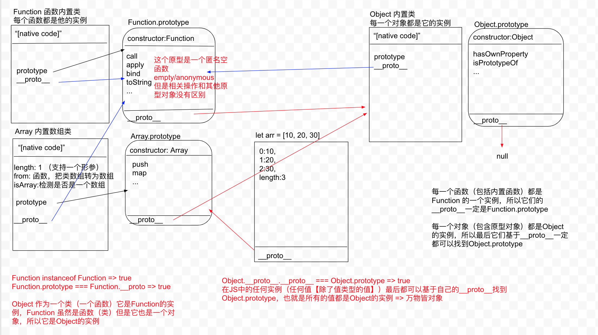

## Function.prototype



- 每一个函数（包括内置函数）都是Function 的一个实例，所以它们的__proto__一定是Function.prototype
- 每一个对象（包含原型对象）都是Object的实例，所以最后它们基于__proto__一定都可以找到Object.prototype

```js
Function instanceof Function => true
Function.prototype === Function.__proto => true

// Object 作为一个类（一个函数）它是Function的实例，Function 虽然是函数（类）但是它也是一个对象，所以它是Object的实例
```

```js
Function instanceof Function => true
Function.prototype === Function.__proto => true

// Object 作为一个类（一个函数）它是Function的实例，Function 虽然是函数（类）但是它也是一个对象，所以它是Object的实例
```