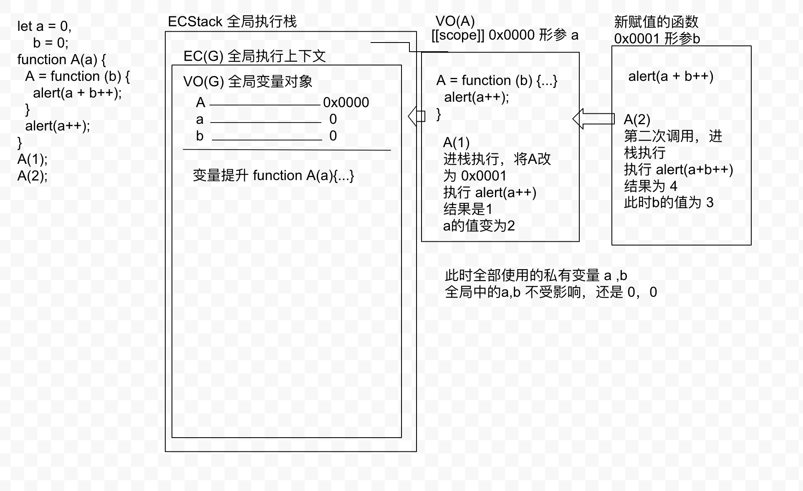

```js
let x = 5;
function fn(x) {
  return function (y) {
    console.log(y + (++x));
  }
}
let f = fn(6);
f(7); // 7 + (++6) = 14
fn(8)(9); // 9 + (++8) = 18;
f(10); // 10 + (++7) = 18;
console.log(x); // 5

/* 
  1. 创建一个函数
  2. 把函数的堆内存地址作为值返回
 */
```

```js
let i = 10;
console.log(5 + i++);
/* 
  先计算 5 + i 的值。那当前的原始值计算
  计算完之后再让 i 的值加1
  所以此时的值 5 + i = 15
  i++ = 11

  即使是 5 + (i++); 也是用上面的规则运算
 */
console.log(5 + (++i));
/* 
  先计算 ++i 的值，再计算 5 + i 的值
 */
```

```js
let a = 0,
    b = 0;
function A(a) {
  A = function (b) {
    alert(a + b++);
  }
  alert(a++);
}
A(1);
A(2);
```


```js
var x = 3;
    obj = { x: 5 };
obj.fn = (function() {
  this.x = ++x;
  return function (y) {
    this.x *= (++x) + y;
    console.log(x);
  }
})();
var fn = obj.fn;
obj.fn(6); // 5 this指向obj
fn(4); // 50 this指向window

/* obj = {
  x: 6,
  fn: function (y) {
    this.x *= (++x) + y;
    console.log(x);
  }
}
5 * (5 + 6) = 55
x = 5;

5 * (6 + 4) = 50;
x = 50 */
```